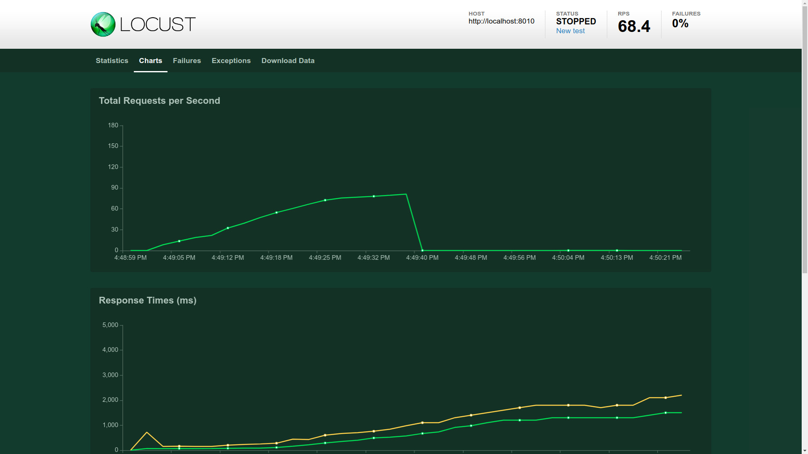
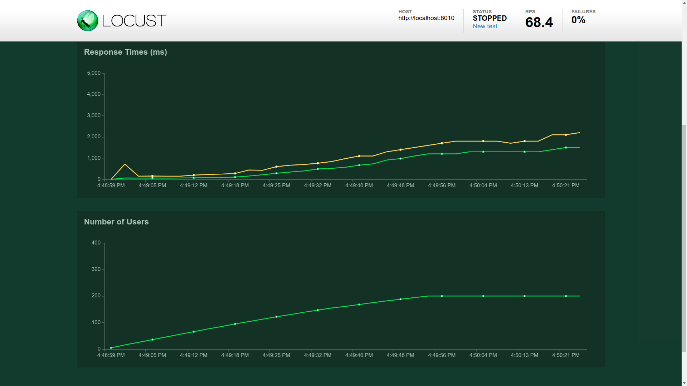
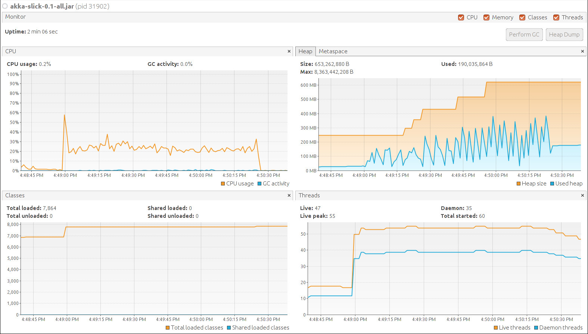
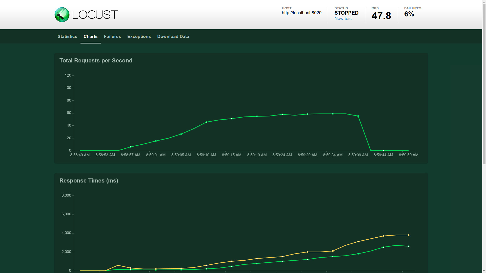
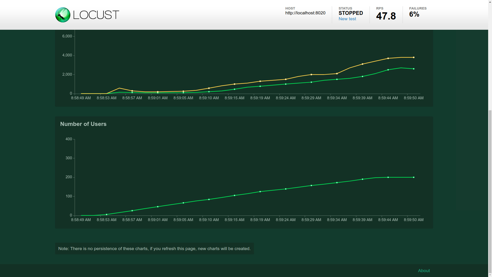
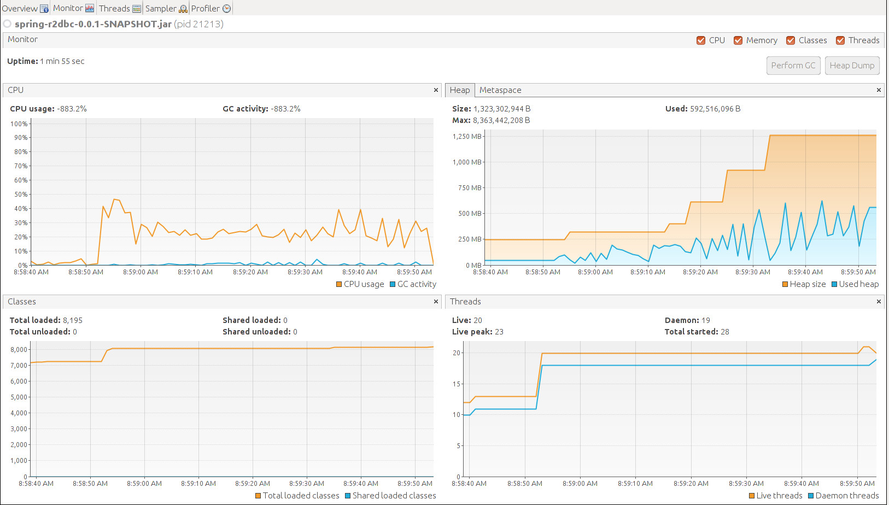
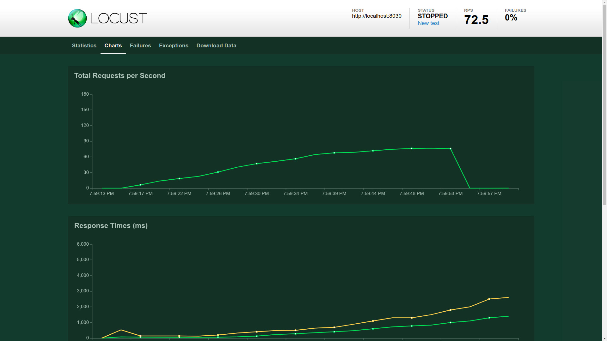
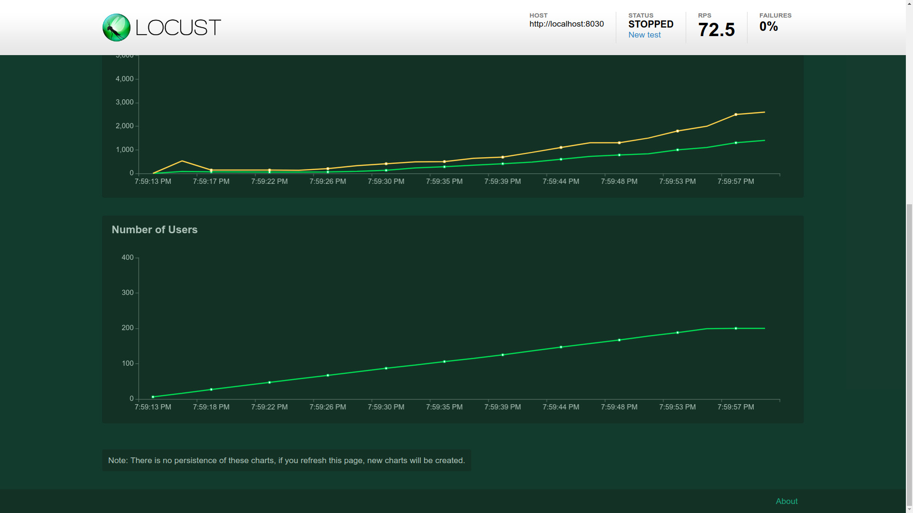
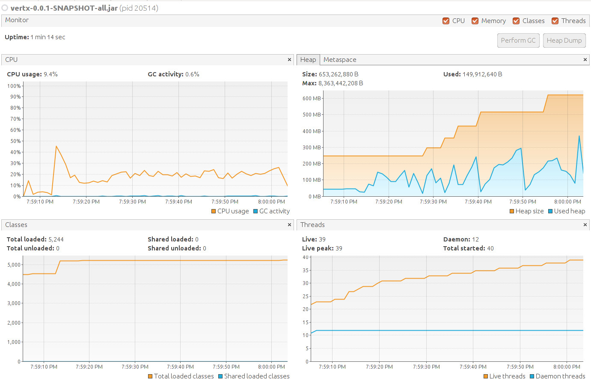

# playground-reactive-stacks

This is a playground project to learn and compare different JVM reactive stacks like:

- Akka-Http with Slick
- Spring-Webflux (Reactor) with R2DBC
- VertX-Web


## Playground application

The playground application is a REST API for tracking Emoji usage, like [EmojiTracker](http://emojitracker.com/).
The application is exposing a REST API with the following endpoints:

|||
|---|---|
|list |GET /emojis |
|create |POST /emojis |
|list recent |GET /emojis/recent?seconds={seconds} |
|get emoji by UTF-8 code |GET /emojis/{code} |
|delete by UTF-8 code |DELETE /emojis/{code} |
|create emoji usage at date |POST /emojis/{code}[?usedAt=2018-10-23T15:49:47Z] |


## Local environment

```bash
java --version
openjdk 11.0.1 2018-10-16
OpenJDK Runtime Environment 18.9 (build 11.0.1+13)
OpenJDK 64-Bit Server VM 18.9 (build 11.0.1+13, mixed mode)
```

```bash
lshw -short
WARNING: you should run this program as super-user.
H/W path       Device       Class          Description
======================================================
                            system         Computer
/0                          bus            Motherboard
/0/0                        memory         15GiB System memory
/0/1                        processor      Intel(R) Core(TM) i7-7500U CPU @ 2.70GHz
...
```


## Benchmark

The benchmark scenario was to run a Locust test to post 1 random emoji usage and list 3 times the recent emoji usages 
of the last 30 seconds.

**Locust settings:**  
min_wait: 50  
max_wait: 2000  
users: 200  
hatch rate: 5

Everything was used with the default configuration, using Postgres DB.


### Akka-Slick







JAR size: 33M  
Lines of code: 543  
Developer experience/productivity (IMO): 3.5/5  
Startup time: ~2.5 sec
```bash
01/26/2019 16:30:00.1548516600
SLF4J: Failed to load class "org.slf4j.impl.StaticLoggerBinder".
SLF4J: Defaulting to no-operation (NOP) logger implementation
SLF4J: See http://www.slf4j.org/codes.html#StaticLoggerBinder for further details.
[INFO] [01/26/2019 16:30:01.786] [main] [Server(akka://app)] Creating server...
[INFO] [01/26/2019 16:30:02.463] [main] [Server(akka://app)] Serving requests on port 8010
```


### Spring-R2DBC

At this time R2DBC is not in Release state. Connection pooling is not implemented yet.







*(Akka and VertX opened almost two times more threads with the default configuration)*

JAR size: 18M  
Lines of code: 326  
Developer experience/productivity (IMO): 5/5  
Startup time: ~3.5 sec
```bash
2019-26-01 16:56:50.1548518210
  .   ____          _            __ _ _
 /\\ / ___'_ __ _ _(_)_ __  __ _ \ \ \ \
( ( )\___ | '_ | '_| | '_ \/ _` | \ \ \ \
 \\/  ___)| |_)| | | | | || (_| |  ) ) ) )
  '  |____| .__|_| |_|_| |_\__, | / / / /
 =========|_|==============|___/=/_/_/_/
 :: Spring Boot ::        (v2.1.0.RELEASE)

2019-01-26 16:56:51.557  INFO 32573 --- [           main] reactivestack.SpringBApplication         : Starting SpringBApplication on zoli-laptop2 with PID 32573 (/home/zoli/drive/work/code/github/playground-reactive-stacks/spring-r2dbc/build/libs/spring-r2dbc-0.0.1-SNAPSHOT.jar started by zoli in /home/zoli/drive/work/code/github/playground-reactive-stacks/spring-r2dbc/build/libs)
2019-01-26 16:56:51.565  INFO 32573 --- [           main] reactivestack.SpringBApplication         : No active profile set, falling back to default profiles: default
2019-01-26 16:56:52.431  WARN 32573 --- [           main] reactor.netty.tcp.TcpResources           : [http] resources will use the default LoopResources: DefaultLoopResources {prefix=reactor-http, daemon=true, selectCount=4, workerCount=4}
2019-01-26 16:56:52.431  WARN 32573 --- [           main] reactor.netty.tcp.TcpResources           : [http] resources will use the default ConnectionProvider: PooledConnectionProvider {name=http, poolFactory=reactor.netty.resources.ConnectionProvider$$Lambda$243/0x000000080036e840@4e07b95f}
2019-01-26 16:56:53.465  INFO 32573 --- [           main] o.s.b.web.embedded.netty.NettyWebServer  : Netty started on port(s): 8020
2019-01-26 16:56:53.469  INFO 32573 --- [           main] reactivestack.SpringBApplication         : Started SpringBApplication in 2.647 seconds (JVM running for 3.216)
```

At the end of the test some connection errors appeared:
```bash
2019-01-27 08:55:40.508 ERROR 16284 --- [tor-tcp-epoll-2] i.r.p.client.ReactorNettyClient          : Error: SEVERITY_LOCALIZED=FATAL, SEVERITY_NON_LOCALIZED=FATAL, CODE=53300, MESSAGE=sorry, too many clients already, FILE=proc.c, LINE=339, ROUTINE=InitProcess
2019-01-27 08:55:40.510  WARN 16284 --- [tor-tcp-epoll-2] io.netty.channel.DefaultChannelPipeline  : An exceptionCaught() event was fired, and it reached at the tail of the pipeline. It usually means the last handler in the pipeline did not handle the exception.

io.netty.channel.ChannelPipelineException: reactor.netty.channel.ChannelOperationsHandler.handlerRemoved() has thrown an exception.

....
Caused by: reactor.core.Exceptions$ErrorCallbackNotImplemented: reactor.netty.channel.AbortedException: Connection has been closed
Caused by: reactor.netty.channel.AbortedException: Connection has been closed
```
```bash

2019-01-27 08:55:42.644 ERROR 16284 --- [or-http-epoll-2] reactor.netty.tcp.TcpServer              : [id: 0xd8fc67fd, L:/0:0:0:0:0:0:0:1%0:8020 - R:/0:0:0:0:0:0:0:1%0:34342] onUncaughtException(SimpleConnection{channel=[id: 0xd8fc67fd, L:/0:0:0:0:0:0:0:1%0:8020 - R:/0:0:0:0:0:0:0:1%0:34342]})

io.netty.channel.unix.Errors$NativeIoException: syscall:read(..) failed: Connection reset by peer
	at io.netty.channel.unix.FileDescriptor.readAddress(..)(Unknown Source) ~[netty-transport-native-unix-common-4.1.31.Final.jar:4.1.31.Final]

```


### VertX







JAR size: 14M  
Lines of code: 887  
Developer experience/productivity (IMO): 1/5 (without RxJava2 callbacks makes it cumbersome)  
Startup time: ~2.5 sec
```bash
01/26/2019 19:54:46.1548528886
SLF4J: Failed to load class "org.slf4j.impl.StaticLoggerBinder".
SLF4J: Defaulting to no-operation (NOP) logger implementation
SLF4J: See http://www.slf4j.org/codes.html#StaticLoggerBinder for further details.
Jan 26, 2019 7:54:47 PM io.vertx.config.impl.ConfigRetrieverImpl
INFO: Config file path: conf/config.json, format:json
Jan 26, 2019 7:54:47 PM io.vertx.ext.asyncsql.impl.PostgreSQLClientImpl
INFO: Creating configuration for localhost:5432
Jan 26, 2019 7:54:47 PM reactivestack.util.VertxHelper
INFO: Created DB connection
Jan 26, 2019 7:54:48 PM reactivestack.util.VertxHelper
INFO: Application is listening on port 8030
```

At the end of the test some errors appeared:
```bash
Jan 26, 2019 8:00:01 PM io.vertx.core.eventbus.impl.HandlerRegistration
SEVERE: Failed to handleMessage. address: __vertx.reply.3011
java.lang.IllegalStateException: Response is closed
	at io.vertx.core.http.impl.HttpServerResponseImpl.checkValid(HttpServerResponseImpl.java:564)
	at io.vertx.core.http.impl.HttpServerResponseImpl.putHeader
```
